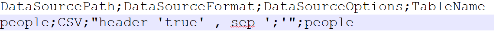
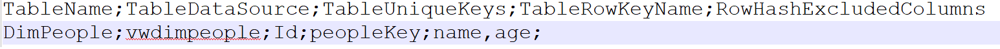

# Configurations

## Data sources configuration file

It is a csv file (with header and ';' separator) which contains definitions of all data sources (data sources are mapped to the spark external tables).
File content example:



### Header 
| Name              | Description                                                  | Sample value              |
| ----------------- | ------------------------------------------------------------ | ------------------------- |
| DataSourcePath    | Data source path (will be will be concatenated with base path) | people/yyyyMMdd=20200101/ |
| DataSourceFormat  | Spark Data Source Format e.g. CSV,PARQUET,JSON               | CSV                       |
| DataSourceOptions | Additional data source settings e.g. header 'true' , sep ';' for CSV | multiline 'true'          |
| TableName         | Table name (Framework automatically adds stage prefix)       | people                    |

## **ETL configuration file**
It is a csv file (with header and ';' separator) which contains definitions of all ETL processes.
File content example



| Name            | Description                                                  | Sample Value |
| --------------- | ------------------------------------------------------------ | ------------ |
| TableName       | Table Name in DW with prefix Dim or Fact                     | DimPeople    |
| TableDataSource | Spark View which defines table (Framework automatically creates table based on view) | vwdimpeople  |
| TableUniqueKeys | List of columns which which uniquely identify the row (separator ',') | Id           |
| TableRowKeyName | Name of primary key column                                   | peopleKey |
| RowHashExcludedColumns | (Optional) List of columns that will not be taken into account for counting hash. If Empty - row hash will computed for all columns  |name,age|

## **Dim or Facts Table Data Source**
Dim or Facts Table Data Source is a spark view which defines the form of the table (table is automatically creates when if doesn't exist). Example:

```sql
CREATE OR REPLACE VIEW vwdimpeople AS SELECT * FROM stage_people
```

### Config
| Name              | Description                                              | Values                                                 |
| ----------------- | -------------------------------------------------------- | ------------------------------------------------------ |
| IsSparkDataBrick  | Decides that engine is run on Databricks (Default false) | True or False                                          |
| DATABASE_HOSTNAME | SQL DW Host Address                                      | localhost (in production env. in should be in secrets) |
| DATABASE_PORT     | SQL DW Server Port (default 1433)                        | 1433                                                   |
| DATABASE_NAME     | SQL DW Database Name                                     | DW                                                     |
| DATABASE_USERNAME | SQL DW Server User Name                                  | (in production env. in should be in secrets)           |
| DATABASE_PASSWORD | SQL DW Server User Name                                  | (in production env. in should be in secrets)           |

### **ETLProcess configurations**

To run the ETL process, the following parameters are required:

| Parameter name             | Description                                                 | Sample Value                            |
| -------------------------- | ----------------------------------------------------------- | --------------------------------------- |
| base_path                  | Base storage path (at first storage must be mounted)        | /mnt/datalake/                          |
| data_source_configurations | Path to data sources configuration file (without base_path) | ETLConfigurations/datasourcesconfig.csv |
| etl_configurations         | Path to etl configuration file (without base_path)          | ETLConfigurations/config.csv            |
| dw_path                    | Path where Spark DW will be created  (without base_path)    | DemoDW                                  |
| dw_name                    | Spark DW name                                               | DemoDW                                  |

Sample script

```python
#Set configuration
Config.IsSparkDataBrick=True
Config.DATABASE_HOSTNAME = 'deltasql'
Config.DATABASE_PORT = 1433
Config.DATABASE_NAME = 'PocDW'
Config.DATABASE_USERNAME = 'user'
Config.DATABASE_PASSWORD = 'password'
Config.DATABASE_ENCRYPT = 'true'

base_path="/mnt/datalake/DW/Demo/"
ddl_scripts_dims=base_path+"SqlViews/Dims"
ddl_scripts_facts=base_path+"SqlViews/Facts"
data_source_configurations="datasourcesconfig.csv"
etl_configurations="config.csv"
dw_path="PocDW"
dw_name="PocDW"
etl_proc = ETLProcess(base_path,
                      data_source_configurations,
                      etl_configurations,
                      dw_path,
                      dw_name)
etl_proc.init()
etl_proc.register_data_sources()
```

