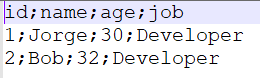
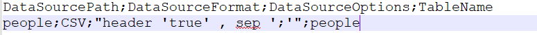
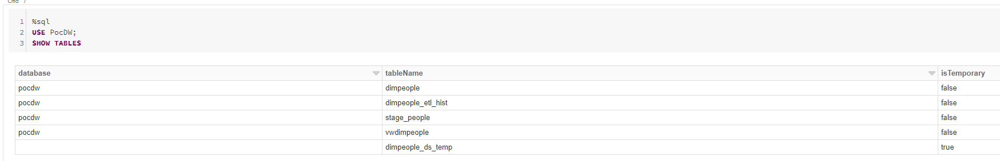

# Dim People Example

The folder samples/Demo contains same data and sample script.

To run this demo please copy this folder to data lake (Azure Blob Storage or Data Lake Storage - this storage must be mounted on Azure Databricks Spark Cluster)

### Data and configurations

Sample data (1)



Data sources configuration file



View for dim table (data sources are available as tables with **stage_** prefix )

```sql
CREATE OR REPLACE VIEW vwdimpeople AS SELECT * FROM stage_people
```

ETL config file


## Running

This example requires Azure DB with stage schema 

Create and run Databricks script (please verify all settings e.g. paths and credentials)

```python
from etl.etl_process import ETLProcess
from utils.config import Config
def run_ddls(ddl_scripts):
  print("Running ddl scripts...")
  files = dbutils.fs.ls(ddl_scripts)
  for file in files:
    print(file.name)
    if file.name.endswith(".sql"):
      ddl= spark.read.text(file.path,wholetext=True).rdd.collect()[0]['value']
      spark.sql(ddl)
  print("All ddl scrips have been successfully executed...")
  
#Set configuration
Config.IsSparkDataBrick=True
Config.DATABASE_HOSTNAME = '****.a'
Config.DATABASE_PORT = 1433
Config.DATABASE_NAME = 'PocDW'
Config.DATABASE_USERNAME = 'user'
Config.DATABASE_PASSWORD = 'password'
Config.DATABASE_ENCRYPT = 'true'

base_path="/mnt/datalake/DW/Demo/"
ddl_scripts_dims=base_path+"SqlViews/Dims"
ddl_scripts_facts=base_path+"SqlViews/Facts"
data_source_configurations="datasourcesconfig.csv"
etl_configurations="config.csv"
dw_path="PocDW"
dw_name="PocDW"
etl_proc = ETLProcess(base_path,
                      data_source_configurations,
                      etl_configurations,
                      dw_path,
                      dw_name)
etl_proc.init()
#etl_proc.get_dw().drop_all_tables()
etl_proc.register_data_sources()
run_ddls(ddl_scripts_dims)
etl_proc.run_dimensions()
#run_ddls(ddl_scripts_facts)
#etl_proc.run_facts()
```

After completion, we check our warehouses



We see three tables (dimpeople,dimpeople_etl_hist, stage_people), view vwdimpeople, oraz temp table dimpeople_ds_temp